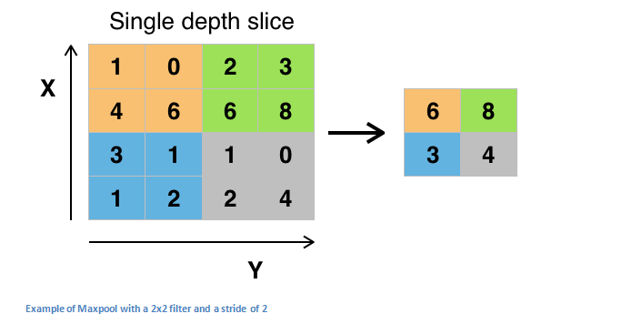

## I. What's the Matrix?

### Session 1
Buckle your seatbelt Dorothy,  
'cause Kansas is going bye-bye! 
-Cypher

### Topics

* Math : Matrix Transpose and Multiplication
* Python
    - Installation (conda, ipython, running)
    - Python Lists 
    - Image Manipulation (read/process/write files)

### A. Intro to Python

### What's Python?
* High-level language for science and cs learning
    - Web development.
        http://flask.pocoo.org/
    - Game development.
        http://inventwithpython.com/pygame/
    - Data science and machine learning!
        https://scikit-learn.org/
    - Music with Python! http://foxdot.org

### Setup Anaconda

    # Version Manager for Python and package manager
    # Anaconda is like rvm in Ruby or nvm in node

    # Install anaconda 3.7. https://www.anaconda.com/distribution/
    # Popular Python versions: 2.7, 3.6 and 3.7

    $ python --version
    $ conda env list
    $ conda create -n nanos python=3.6 ipython
    $ conda activate nanos
    $ python --version

    # Update conda
    $ conda update conda
    $ conda update anaconda

    # Remove environment
    $ conda env remove --name nanos

    # Exercise
    # Create a conda environment named 'python2.7' having python v2.7

### Running Interactive Python

    $ ipython

    [1]: print("Hello world!")

    [2]: def add(first, second):
            return first + second

    [3]: print("Total:", add(3, 5))

    [4]: help(print)  # press 'q' to quit help
    [5]: ?print

    [6]: help(add) # press 'q' to quit help

    [7]: quit()

### Python List
    [1]: numbers = [1, 2, 3, 4, 5]
    [2]: numbers

    [3]: names = ['george', 'donald', 'obama']
    [4]: print(names, len(names))

    [5]: for prez in names:
            print("One prez: ", prez)

    [6]: print([prez for prez in names])

### List slices
    [1]: numbers = [0, 1, 2, 3, 4, 5, 6, 7, 8, 9]

    [2]: numbers[0]
    [3]: numbers[3:7]
    [4]: numbers[0:9:2]
    [5]: numbers[0:9:3]

    [6]: multiplies_of_3 = numbers[0:9:3]

    [7]: a = [1, 2, 3, 4]
    [8]: b = [4, 3, 2, 1]
    [9]: c = [*(a,b)]
    [10]: c = [*a, *b]

### List Comprehension
    [1]: numbers = [0, 1, 2, 3, 4, 5, 6, 7, 8, 9]

    [2]: odds = [n for n in numbers if n % 2 == 1]
    [3]: odds # same as print(odds)

    [4]: triple_odds = [3 * n for n in numbers if n % 2 == 1]
    [5]: dozen = [n for n in range(12)]
    [6]: another_dozen = list(range(12))
    [7]: triple_map = {i:3*i for i in range(10)}

         # Double Array of 3 rows and 4 columns
    [8]: double_array = [[i*p+1 for i in range(4)] for p in range(3)]
    [9]: print(len(double_array), "rows x",
               len(double_array[0]), "columns")

### Python Challenges

    1. List of squares of the first 7 numbers using list comprehension

    2. Given a list of president names, return the list of presidents that contain the letter 'h' either in the first name or last name

    Complete the list using wikipedia
    https://en.wikipedia.org/wiki/List_of_Presidents_of_the_United_States

    presidents = ["george, washington", "john, adams", "thomas, jefferson"]

    3. Retrieve the first names of all the president names
    Hint: look for 'find' and 'split' from:
    https://docs.python.org/2/library/string.html#string-functions

    4. Retrieve the list of presidents in which the first name has an 'h'

### Reference

- Whirlwind Tour of Python https://nbviewer.jupyter.org/github/jakevdp/WhirlwindTourOfPython/blob/master/Index.ipynb

- Python 
http://cs231n.github.io/python-numpy-tutorial/

- List Comprehension 
https://treyhunner.com/2015/12/python-list-comprehensions-now-in-color/

- Python Practice!!! https://codingbat.com/python

### B. Math - Matrix

### Matrix Transpose

    A = [[0, 1, 2, 3],
        [4, 5, 6, 7],
        [8, 9, 10, 11]]

    tranpose(A) = [
        [0, 4, 8],
        [1, 5, 9],
        [2, 6, 10],
        [3, 7, 11]
    ]

Python challenge: Implement transpose()

### Matrix Multiplication

http://matrixmultiplication.xyz/

    X = A * B

    X[i,j] = Sum(A[i,k] * B[k,j]) over all rows i, columns j, k

    A: m x n (m rows by n columns)
    B: n x p (n rows by p columns)
    X: m x p (m rows by p columns)

### Implement Matrix Multiplication

    def multiply(A, B):
        None
    
    A = [[1, 2, 3, 8],
        [2, 0, 3, 9],
        [0, 1, 3, 1]]

    B = [[3, 1], [4, 4], [6, 5], [2, 0]]

    print(len(A), len(A[0]))
    print(len(B), len(B[0]))

    X = multiply(A, B)

### C. Images with Python

### RGB/RGBA Color Model

    An Image consists of 4 channels:
        * Red    * Green
        * Blue   * Alpha (optional)

    An RGB image of 200x200 pixels contains 
    3 layers of 200x200 values.

    An RGBA image of 200x200 pixels contains 
    4 layers of 200x200 values.

    Each pixel value goes from 0 to 255

    * How many color combinations can we achieve in a pixel?
    * How many pixels can we have in a 5 mpx, 12 mpx, 24 mpx?
      What would be the width/height of such images?

#### Installing Python libraries

    $ conda activate nanos
    $ conda install matplotlit
    $ conda install numpy

#### Ex: Create a greyscale image

    import matplotlib.pyplot as plt
    import numpy as np

    img = plt.imread("panda-corner.jpg")
    nrows, ncols = img.shape[0], img.shape[1]
    nchannels = img.shape[2]

    greyed = np.zeros((nrows, ncols, nchannels), dtype=int)

    for row in range(nrows):
        for col in range(ncols):
            avg = sum(img[row,col,:]) / 3
            greyed[row,col,:] = avg

    plt.imshow(greyed), plt.show()
    plt.imsave("panda-grey.png", greyed)

#### Ex: Image Compression

Suppose you have an image of size 640x360, how can we get an image of size 320x180?

    import matplotlib.pyplot as plt

    img = plt.imread("panda-corner.jpg")
    nrows, ncols = int(img.shape[0]/2), int(img.shape[1]/2)

    smaller = img[0:nrows, 0:ncols/2, :]
    plt.imshow(smaller), plt.show()

    img.shape, smaller.shape

    # This is NOT image compressions. This is cropping!
    # What should be the value of each pixel???

### Downsampling

<!-- (https://adeshpande3.github.io/assets/MaxPool.png) -->

Can you code this?

#### Ex: Downsampling

    import matplotlib.pyplot as plt
    import numpy as np

    img = plt.imread("panda-corner.jpg")
    nrows, ncols, nchannels = img.shape[0], img.shape[1], img.shape[2]
    half_rows, half_cols = int(nrows / 2), int(ncols / 2)

    buffer = np.zeros((half_rows, half_cols, nchannels), dtype=int)

    for row in range(2, half_rows-2):
        for col in range(2, half_cols-2):
            selection = img[row*2:(row+1)*2, col*2:(col+1)*2,:]
            for c in range(nchannels):
                buffer[row, col, c] = np.max(selection[:,:,c])

#### Image Kernels and convolutions

http://setosa.io/ev/image-kernels/

    # Convolution
    # https://docs.gimp.org/2.8/en/plug-in-convmatrix.html

    # Python Challenge: implement image kernel!
    # More things to try out

    1. Process only for a small section (not the full image)
    2. Process the inverse (all the areas BUT the selected area)
    3. Use a different mask for the selected area! Say some rabbit!
    4. Try out some colormap ("hot"?)

#### Ex: Image kernel

    sharpen = [
        [0, -1, 0],
        [-1, 5, -1],
        [0, -1, 0]
    ]
    buffer = np.zeros((nrows, ncols, 3))

    for i in range(1, nrows-1):
        for j in range(1, ncols-1):
            for c in range(nchannels):
                source = img[i-1:i+2, j-1:j+2, c]
                # Wait: sum of products? this looks familiar, right?
                buffer[i][j][c] = np.sum(np.multiply(source, sharpen))

    buffer = np.clip(buffer, 0, 255).astype(int)

#### Ex: Image kernel using matrix multiply

    sharpen = [
        [0, -1, 0],
        [-1, 5, -1],
        [0, -1, 0]
    ]
    buffer = np.zeros((nrows, ncols, 3))

    blur = np.array(blur).reshape((1, 3*3)) # so we can dot the source

    for i in range(1, nrows-1):
        for j in range(1, ncols-1):
            for c in range(nchannels):
                source = img[i-1:i+2, j-1:j+2, c].reshape((3*3, 1))
                # x10: Massive performance gains for matrix multiply if numpy supports GPU
                buffer[i][j][c] = np.matmul(sharpen, source)

    buffer = np.clip(buffer, 0, 255).astype(int)

### 2D Matrices Transformations

* https://thebookofshaders.com/08/
  - Translation
  - Rotation
  - Scaling

- No worries. This will be covered in your algebra class!

* Interactive Algebra
http://immersivemath.com/ila/index.html

### Reference

* Matrix:
    https://leonardoaraujosantos.gitbooks.io/artificial-inteligence/content/linear_algebra.html

* Image api: https://matplotlib.org/users/image_tutorial.html
* Pixels: https://processing.org/tutorials/pixels/
* RGB: https://developer.mozilla.org/en-US/docs/Web/CSS/CSS_Colors/Color_picker_tool

### Python Style Guide

* https://docs.ckan.org/en/2.8/contributing/python.html

* Hitchiker's Guide to Python 
  https://docs.python-guide.org/writing/style/

* PEP8 
  https://www.python.org/dev/peps/pep-0008/

* Google 
  http://google.github.io/styleguide/pyguide.html

### Tools for better Python

  * pylint: linter for Python
  https://www.pylint.org/
  
        $ pylint -E --rcfile=/path/to/pylintrc file.py file2.py

  - https://github.com/google/seq2seq/blob/master/pylintrc
  - https://github.com/vinitkumar/googlecl/blob/master/googlecl-pylint.rc

### Testing Python

  - https://docs.python-guide.org/writing/tests/

  - pytest 
  https://docs.pytest.org/en/latest/

  - Unit test 
  https://docs.python.org/3/library/unittest.html

### Debugging Python

  - pdb
    - https://docs.python.org/3/library/pdb.html
    - https://realpython.com/python-debugging-pdb/

### Pyconf 2019

- About: https://us.pycon.org/2019/about/
- Proposing a Talk: https://us.pycon.org/2019/speaking/talks/
- Proposing a Tutorial: https://us.pycon.org/2019/speaking/tutorials/
- Rejected PyCon proposals:
http://akaptur.com/blog/2014/09/11/rejected-pycon-proposals/
- Speaking: https://hynek.me/articles/speaking/

### Zen of Python

import this

    Beautiful is better than ugly.
    Explicit is better than implicit.
    Simple is better than complex.
    Complex is better than complicated.
    Flat is better than nested.
    Sparse is better than dense.
    Readability counts.
    Special cases aren't special enough to break the rules.
    Although practicality beats purity.
    Errors should never pass silently.
    Unless explicitly silenced.
    In the face of ambiguity, refuse the temptation to guess.
    There should be one—and preferably only one—obvious way to do it.
    Although that way may not be obvious at first unless you're Dutch.
    Now is better than never.
    Although never is often better than right now.[n 1]
    If the implementation is hard to explain, it's a bad idea.
    If the implementation is easy to explain, it may be a good idea.
    Namespaces are one honking great idea—let's do more of those! 

  - Tim Peters, 1999

### Credits
* Neo, Morpheus and Trinity
* https://computersciencewiki.org/index.php/Max-pooling_/_Pooling
